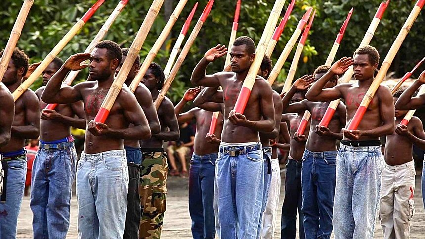
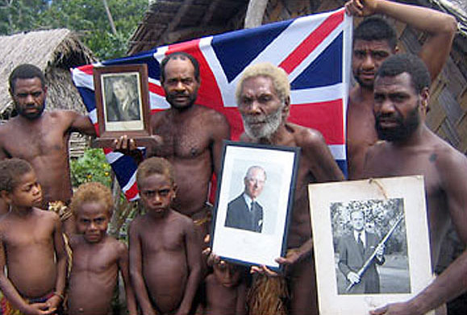

Rdzenni mieszkańcy wysp na Pacyfiku żyli spokojnie przez wieki, rozrzuceni po wielu archipelagach, rozwijając specyficzną kulturę i prymitywne wierzenia. Przybycie pierwszych białych Europejczyków wprowadziło trochę chaosu, ale ich zwyczaje szybko zostały wchłonięte przez autochtonów. Prawdziwe zamieszanie wywołała dopiero stała obecność białych na początku XX wieku i podczas II wojny światowej. Wśród tubylców, w wielu miejscach jednocześnie, rozwinął się wtedy tzw. kult cargo, jedno z najbardziej osobliwych wierzeń nowożytnych.
Autochtoni zaczęli obserwować niespotykane dotąd zjawiska – oto nad ich głowami pojawiły się wielkie i głośne latające obiekty, których nie miało prawa tam być. Co więcej, biali ludzie zaczęli budować dziwne budynki i wykonywać dziwaczne rytuały, po pewnym czasie na wyspach lądowały metalowe ptaki, a w nich zawierały się drogocenne ładunki, żywność i narzędzia, czyli cargo. Przybysze natomiast nie mieli przy sobie wielu rzeczy, a także nigdy nie tworzyli ani nie naprawiali niczego sami –rozmawiali przez osobliwe pudełka, a następnie zepsute narzędzia były odsyłane do nieba i przysyłane z powrotem - nowe i w większych ilościach.

Według przekonań mieszkańców wysp na Pacyfiku wszelkie dobra materialne i wiedza jakie posiada człowiek pochodzi od jego przodków. Tubylcy szybko więc połączyli fakty i wywnioskowali, że biali ludzie są pośrednikami bogów (tudzież przodków), a poprzez rytuały otrzymują niezbędne dobra, wszystko jednak zagarniając dla siebie. Skoro dotychczasowe, lokalne praktyki nie przynosiły tak widowiskowych efektów, mieszkańcy zaczęli naśladować obcych w nadziei, że im także dane będą pożądane przedmioty z niebios. Niektóre grupy gorliwie przyjęły chrześcijaństwo, oczekując wzbogacenia się. Inne plemiona w tym celu zaczęły uklepywać pasy startowe, wznosić wieże z bambusów, rozmawiać przez „telefony” z kamienia i paradować z kijami na ramionach. Ciężko im było zrozumieć, dlaczego te wszystkie czynności nie odnoszą takiego skutku, jak miało to miejsce w przypadku kolonizatorów. Jedynym wyjaśnieniem był fakt, że biali otrzymują te wszystkie dary, bo umarł za nich ich zbawca - Jezus. Tubylcy potrzebowali więc swojego Mesjasza.

Na wyspach pacyficznych działało wielu kapłanów i przywódców kultu cargo. Głosili oni, że kolonizatorzy ukradli tajemnice bogów i okradają ich z drogocennych ładunków, nie dzieląc się z tubylcami. Posłuch znajdowały hasła równościowe i egalitarystyczne, a także antyniewolnicze czy niepodległościowe. Najsłynniejszym prorokiem kultu był John Frum (od „John from USA”) – legendarna postać działająca na wyspach należących do Vanatu (Nowe Hebrydy). Głosił silnie antykolonialne proroctwa, podburzając lokalnych mieszkańców do rabowania portów i lotnisk przybyszów, w których znajdowały się ładunki cargo. Przed śmiercią Frum ogłosił, że wróci w chwale, by usunąć nierówności społeczne oraz przyniesie drogocenne cargo i nową walutę – monety z kokosem na awersie. Jednak jego powtórne przyjście miało być poprzedzone usunięciem wszystkich pieniędzy białych ludzi (i białych ludzi wraz z nimi). Doprowadziło to do dalszej eskalacji konfliktów, a także do kryzysu wyspiarskiej gospodarki, gdyż wyznawcy Fruma przestawali pracować i uznawać „białą” walutę. Później pojawił się także dogmat, że Frum odszedł, żeby stać się królem Ameryki, który powróci w wielkich statkach ze wschodu i przywiezie mnóstwo ładunków cargo. Jakież było zdziwienie tubylców, kiedy w czasie II wojny światowej okręty floty amerykańskiej przybiły do brzegu, a wśród żołnierzy widać było także czarnoskórych, dobrze ubranych i odżywionych. Widocznie udało im się dostąpić bogactw cargo, co tylko potwierdzało przypuszczenia tubylców.

Kulty różniły się w zależności od regionu czy wyspy: na niektórych wyspach czczeni byli szczególnie katoliccy święci, a gdzieniegdzie za bóstwa uznane zostały postacie popkulturowe, takie jak Wujek Sam czy Santa Claus. Na Nowych Hebrydach (wtedy kondominium brytyjsko-francuskie) ustanowiony został również kult obrazu Jerzego V – brytyjski król podczas wizyty wywarł na tubylcach tak ogromne wrażenie swoimi bogactwami, że natychmiast został uznany za boga. Podobnie zresztą jak książę Filip, który wyspy odwiedził w 1974r. wraz z królową brytyjską (która o dziwo nie została deifikowana). Oddawanie hołdu wizerunkom ubóstwionych władców miało przybliżyć wiernych do takich samych bogactw. Natomiast na jednej z wysp należących do Papui-Nowej Gwinei, podczas święcenia kapliczki przez biskupa tubylcy poderżnęli gardło ochotnikowi, z którego ofiara (tak jak ofiara Chrystusa) miała zapewnić im ładunki cargo.

Najciekawszym fenomenem pozostaje fakt, że kult cargo rozwinął się w wielu miejscach na Pacyfiku jednocześnie i niezależnie. Może to wskazywać na istnienie uniwersalnych cech ludzkiej psychiki i tłumaczyć fakt pojawienia się podobnych do siebie wierzeń w różnych częściach globu w przeszłości. Antropolodzy i religioznawcy mogli obserwować powstanie i rozwój tej osobliwej religii i dzięki temu odnotować mechanizmy, które rządzą takimi zjawiskami. Cechą charakterystyczną tych wierzeń było okresowe zanikanie i nasilanie się kultu (w różnych wersjach), w zależności od stanu posiadania wyznawców. Obecnie kulty cargo zostały zasymilowane przez chrześcijaństwo, co nie było trudne ze względu na podobieństwa głoszonych idei (m.in. egalitaryzm, równość społeczna, ekonomiczna itp.). Turyści mogą oglądać rytuały cargo, ale bardziej jako ciekawostkę niż rzeczywisty wyraz pobożności. Płacą, chcąc oglądać te fascynujące spektakle, a miejscowi bogacą się wykonując swoje religijne praktyki. Ale czy od samego początku nie o to im właśnie chodziło?