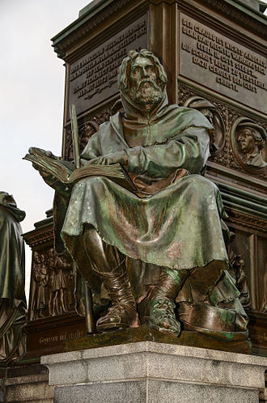
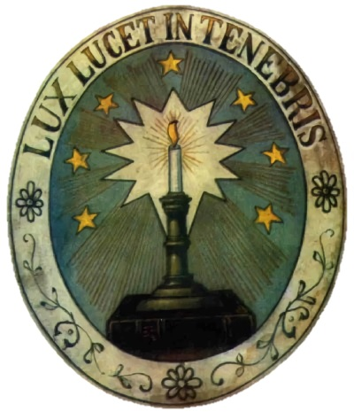
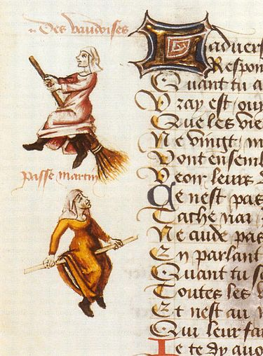
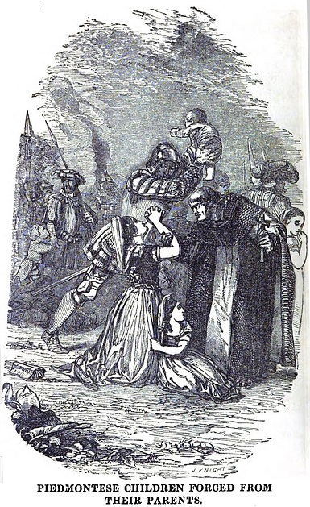
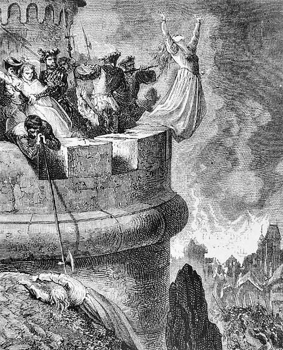

[Tekst na blogu został zmieniony ponieważ zbierając informacje do odcinka bazowałem na starszych opracowaniach, w których Waldensom przypisywano brak wiary w katolickie doktryny od samego początku, co zdaniem współczesnych badaczy nie jest prawdą.]

Już w ciągu kilku pierwszych wieków dochodziło do tarć w ramach chrześcijaństwa dotyczących tego czym tak naprawdę ono jest. Wielu ludzi widziało w nauczaniu Chrystusa i apostołów radykalny przekaz dla świata. Nie byli oni zbyt przekonani do instytucji i oferty proponowanej przez hierarchów. Niektórzy tak bardzo, że uważali, że interpretacje “oficjalne” są po prostu zdradą nauczania Jezusa z Nazaretu. Jeden z takich ruchów funkcjonował na pograniczu współczesnej Francji i Włoch, w regionie Alp Kotyjskich. Jego losy są nierozerwalnie związane z tak zwanym Piotrem Waldo (lub, w innej wersji, Waldesem), którego narodziny datuje się na okolice 1140 roku. Piotr był bardzo zamożnym kupcem z Lyonu, który w okolicach 1160 roku przeżył gwałtowną przemianę. Jej katalizatorami były między innymi takie wydarzenia jak zapoznanie się z historią Świętego Aleksego Rzymskiego i nagła śmierć przyjaciela. Pod wpływem tych wydarzeń Piotr/Waldes miał jakoby doświadczyć obecności Chrystusa. Poruszony zostawił swoją rodzinę z częścią majątku i oddał się studiom religijnym. Jakiś czas potem zaczął publicznie nauczać i rozdawać potrzebującym to co pozostało mu z kupieckiego dobytku.

Jednym z motywów przewodnich jego nauczania była prostota i odrzucenie bogactw materialnych. Piotr krytykował instytucjonalny kościół za skupienie się na pieniądzach i władzy. Używanie łaciny i rytualizację nabożeństw postrzegał jako przeszkodę w przekazywaniu ludziom nauczania chrześcijańskiego. Jego zdaniem esencją chrześcijaństwa nie były rytuały a wiara powinna być prosta i przejawiać się przede wszystkim w stosunku do drugiego człowieka, polegać na niesieniu pomocy bliźnim oraz głoszeniu ewangelii. Nie jest pewne czy Waldo działał w ramach już istniejącej grupy czy dał początek nowej. Tak czy inaczej stał on za wzrostem popularności tejże. Do 1170 roku była już ona w pełni ukonstytuowana i aktywnie działała w regionie Alp Kotyjskich. Wśród jej zwolenników nie brakowało duchownych. Uczniowie Piotra/Waldesa określali się mianem Ubogich Chrystusa, Ubogich z Lyonu/ Lombardii lub po prostu Braćmi. Świat zewnętrzny znał ich jednak jako Waldensów.

Rdzeniem ich działalności była pomoc ubogim, których w średniowiecznym społeczeństwie nie brakowało oraz przekazywanie nauk wynikających z Biblii. To właśnie Waldensom przypisuje się pierwsze w historii tłumaczenie Nowego Testamentu z łaciny na mówiony język europejski. Waldo miał jakoby opłacić przekład na język franko-prowansalski. Rosnąca popularność Waldensów i ich ekspansja w kierunku północnej Italii sprawiły, że zainteresowała się nimi kościół. W 1179 roku Piotr stanął przed papieżem i wyłożył mu swoje poglądy. Rzymowi szczególnie nie podobały się poglądy mogące prowadzić do marginalizacji roli duchowieństwa. Waldensi uważali, że każdy jest powołany do nauczania i służenia. Rezultatem spotkania było potępienie nauczania Waldensów na Trzecim Soborze Laterańskim. W 1184 roku Piotr i jego zwolennicy zostali ekskomunikowani oraz wygnani z Lyonu. Nie zarzucili jednak swojej działalności. Wędrowni kaznodzieje z jego grupy odwiedzali kolejne wspólnoty, odprawiali nabożeństwa i nauczali. W wyniku wygnania nauki Waldensów rozprzestrzeniły się także w Niemczech (gdzie najprawdopodobniej udał się i zmarł Waldo) i Hiszpanii.

Dokładne śledzenie losów Waldensów jest trudne. Stoi za tym brak źródeł i ich tendencyjność. Średniowieczni pisarze historyczni (często zresztą duchowni) mieli manierę wrzucania wszystkich grup do jednego worka i byli bardziej zainteresowani oczernianiem ich niż rzetelnym opisem. Waldensom zarzucano brak wiary w prawdziwą przemianę chleba i wina w ciało i krew Chrystusa oraz totalne odrzucenie instytucji kościoła. Starsze prace dawały wiarę tym zarzutom, ale współcześni historycy uważają, że poglądy te pojawiły się później, w wyniku odrzucenia Waldensów przez hierarchię. Kolejnym problemem ze źródłami jest moda literacka polegająca na tworzeniu swoistych “genealogii herezji”*. Danej grupie przypisywano pochodzenie od innych i wskazywano na oryginalnego herezjarchę, nie troszcząc się zupełnie o rzetelność. Z drugiej strony- wiele z tych grup rzeczywiście na siebie wzajemnie wpływało. Odsianie ziarna od plew jest tutaj jednak bardzo ciężkie i prawdopodobnie nawet niemożliwe. Ponadto często korzystano z nazw głośnych herezji na określanie grup które niekoniecznie miały z nimi coś wspólnego. Manichejczyk czy arianin były po prostu synonimami słowa heretyk, na podobnej zasadzie jak wszystkich nomadów określano mianem Scytów (mimo, że etnicznie nie mieli nic wspólnego z historyczną grupą indoirańskich plemion).

To jednak nie koniec problemów. Protestanccy historycy, szukający podparcia dla swoich teologicznych idei, często sięgali po fakt istnienia grup heretyckich aby uzasadnić różne wersje tak zwanego sukcesjonizmu. Już tłumaczę o co chodzi- w Biblii Chrystus mówi jasno, że zakłada kościół, którego bramy piekielne nie przemogą. Z biegiem czasu różni reformatorzy, porównując ewolucję wierzeń katolickich z tym co ich zdaniem mówi Biblia, przesuwali w dół granicę tego kiedy doszło do “zdrady”. Trzeba było jakoś wytłumaczyć dysonans między obietnicą Chrystusa a przekonaniem, że od “zdrady” do “odrodzenia” upłynęło np. 1000 lat. Bóg się pomylił? Kłamał? Nie! “Prawdziwy kościół” istniał cały czas! To właśnie “heretycy” byli tym kościołem, a “pogański” Rzym ich prześladował, nie mogąc znieść ich “prawowierności”. W ten sposób również wykoślawiano rzeczywiste poglądy i praktyki “heretyków”, chcąc jak najbardziej dopasować je do wyznania z którego dany historyk się wywodził. My jednak będziemy uczciwi i zamiast konfabulacji po prostu przyznamy, że wiele wydarzeń z historii Waldensów tonie w odmętach historii.

Wygnanie przyczyniło się do rozpropagowania poglądów grupy w Hiszpanii, południowej Francji, zachodnich Niemczech i północnych Włoszech. Kościół zrozumiał, że musi działać bardziej zdecydowanie. W 1192 biskup Toul wydał rozkaz aresztowania wszystkich Waldensów żyjących na jego ziemiach. W 1194 roku Alfons II z Aragonu wygnał Waldensów ze swoich ziem i zaczął karać każdego kto udzielał im schronienia. W 1197 roku na synodzie w Gironie wprowadzono karę śmierci za bycie Waldensem. W 1211 roku doszło do spalenia 80 Waldensów w Strasburgu. W 1214 roku doszło do kolejnych egzekucji w Maurillac. Do końca XIII wieku grupy Waldensów w Hiszpanii przestały istnieć. Przetrwały jednak we Francji i we Włoszech, głównie w Alpach Kotyjskich. Dzięki pomocy współwyznawców z Lombardii, francuscy Waldensi zaczęli odzyskiwać grunt w XV wieku, co spotkało się z nową falą prześladowań ze strony kościoła. Doszło nawet do krucjaty, która zaatakowała Waldensów w Piemoncie i Delfinacie. Nie znamy dokładnej liczby ofiar i uciekinierów. Wiemy jednak o zbiegach udających się do Prowansji i w głąb Włoch. Ocalałe wspólnoty zaszyły się w dolinach alpejskich.

Waldensi z Alp Kotyjskich żyli sobie we względnym spokoju, nie wychylając się. W XVI wieku zaczęły do nich docierać informacje o reformacji. Liderzy wspólnot spotkali się z protestantami aby dowiedzieć się więcej. Po rekonesansie i kilku spotkaniach zdecydowali o przyłączeniu się do kalwinów. W 1532 roku, w Chanforan, William Farel spotkał się z liderami Waldensów. Oficjalnie przyjęli oni kalwińskie wyznanie wiary i potwierdzili zgodność z kościołem reformowanym. Kalwińska Biblia po francusku, przetłumaczona przez Pierra Olivetan i wydana w 1535 roku, bazowała częściowo na tłumaczeniu Nowego Testamentu przez Waldensów. Przyłączanie się do ruchów reformatorskich miało miejsce nie tylko w regionie alpejskim, ale także w Niemczech i reszcie Francji. Reformacja tchnęła nowego ducha w Waldensów i wznowili oni działalność misjonarską. Oczywiście ten fakt nie umknął uwadze papiestwa i feudalnych władców. Waldensi, nauczeni doświadczeniami z przeszłości, zaczęli budować własne twierdze i zbroić się. Doszło nawet do starć i ataku na klasztor katolicki.

W reakcji na wznowienie otwartej działalności przez Waldensów król Franiszek I zezwolił szlachcie prowansalskiej na zaatakowanie heretyków. Akcje zaczęły się w 1545 roku. Dowódcami francuskimi byli des Aimars i Mayniers. Dołączyły do nich wojska papieskie z Venaissin. Różnica potencjałów była tak duża, że ciężko mówić tutaj o walkach. Wydarzenia te określa się w historiografii jako Masakrę Merindol. W trakcie czystek czasie zabito od kilkuset do kilku tysięcy ludzi. Setki zostały ponadto zesłane do niewolniczej pracy na francuskich okrętach (co było w zasadzie wyrokiem śmierci, tylko rozciągniętym w czasie). Łącznie zniszczono od 22 do 28 wiosek. Według Williama Montera po raz pierwszy w historii Europy doszło tutaj do rozstrzelania ideologicznych jeńców przez pluton egzekucyjny. W nagrodę za sprawnie przeprowadzoną “kampanię” papież Paweł II nagrodził Maynier’a przyjmując go z honorami należnymi cesarzowi. Walki przeciw protestantom we Francji (w tym Waldensom) trwały jeszcze do 1598 roku.

Był to ciężki czas dla Waldensów jako, że zamieszkiwali oni głównie tereny Sabaudii, która była orędownikiem sprawy katolickiej. Walki zostały zakończone edyktem nantejskim ogłoszonym przez króla Henryka IV. Edykt ten dawał protestantom wolność wyznania i uznawał ich podmiotowość prawną. Była to część prawdziwego przełomu w prawodawstwie dotyczącym religii- niekatoliccy chrześcijanie przestawali być rozpatrywani tylko jako heretycy czy schizmatycy (a więc- w zasadzie przestępcy) a zaczynali być członkami legalnych wyznań, mającymi swoje prawa. Oczywiście wielu duchownych i możnych katolickich nie chciało się z pogodzić z tym faktem. Ich działalność połączona z wieloma innymi czynnikami sprawiła, że klimat polityczny i społeczny we Francji i Sabaudii zaczął się zmieniać w drugiej połowie XVII wieku. W rzeczonej Sabaudii doprowadziło to do tak zwanej “Piemonckiej Wielkanocy”. Jej bezpośrednią przyczyną był edykt z 1655 roku nakazujący:

Każda głowa rodziny, razem z jej członkami, która należy do reformowanej religii, niezależnie od stopnia i warunków, włączając w to mieszkańców ...(tutaj lista miejscowości)... winna, w terminie 3 dni od publikacji edyktu opuścić swoje miejsce zamieszkania i przenieść się do ...(lista lokacji)... Karą dla odmawiających podporządkowania się rozkazowi powinna być śmierć chyba, że przejdą oni na katolicyzm. 

Oczywiście większość Waldensów nie posłuchała się. Rząd wysłał przeciwko nim 15 k żołnierzy chcąc wyegzekwować edykt. Napięcia między Waldensami a żołnierzami znalazły swój finał 24 kwietnia 1655 roku. Doszło wówczas pogromu w którym zginęło od 4k do 6k Waldensów. Był to początek masowego eksodusu protestantów z Sabaudii oraz wojny partyzanckiej trwającej do 1690 roku. Dodatkowo, Ludwik XIV wycofał edykt nantejski i rozpoczął na nowo prześladowania protestantów. Wojska francuskie zajęły regiony zamieszkane przez Waldensów w Delfinacie i groźbą masakry wymusiły konwersje około 8k Waldensów. Wielu wybrało jednak ucieczkę do Niemiec. W Sabaudii również doszło do podobnej akcji- książę Wiktor Amadeusz II nakazał w 1686 roku zniszczenie zborów Waldensów i nakazał siłowe konwersje. Waldensi postanowili się bronić co wobec przewagi wojsk rządowych zakończyło się kolejną masakrą w której zginęło 2k ludzi. Jej pokłosiem było “nawrócenie” kolejnych 2k na katolicyzm i uwięzienie 8k. Warto dodać, że połowa z tych 8k zginęła w ciągu pół roku z powodu celowo wywołanego głodu i chorób wynikających ze złych warunków życia.

Te wydarzenia i podobne ataki na kalwinów we Francji sprawiły, że protestanci zaczęli masowo opuszczać Francję i kraje z jej strefy wpływów. Najpopularniejszymi kierunkami migracji były Wielka Brytania, Holandia i Niemcy. Wielu szukało jednak szczęścia także w Nowym Świecie a nawet w Afryce. Zaowocowało to pojawieniem się wspólnot Waldensów w tak egzotycznych miejscach jak Urugwaj czy Argentyna. Część zaszyła się jednak w swoich alpejskich matecznikach. Zmianę w ich położeniu ostatecznie przyniosła Rewolucja Francuska, nadająca im wolność wyznania. Korzystając z nowo nabytej wolności Waldensi zaczęli na nowo organizować się. W XIX wieku tereny zamieszkane przez większość Waldensów stały się częścią królestwa Włoch. Wieki prześladowań i migracji sprawiły jednak, że wspólnota była bardzo mała. Współcześnie liczbę Waldensów szacuje się na około 50k z czego 30k żyje we Włoszech. Większe społeczności zamieszkują także Argentynę i Urugwaj. W 2015 roku papież Franciszek odwiedził kościół Waldensów w Turynie, gdzie przeprosił za kilkaset lat masakr i prześladowań ze strony kościoła katolickiego.
