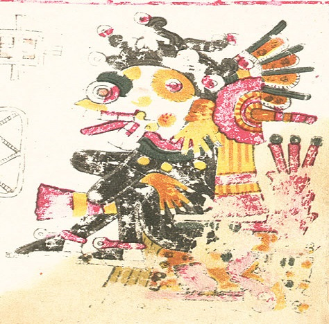
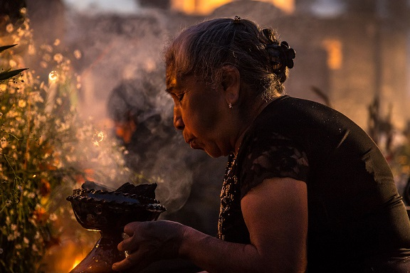
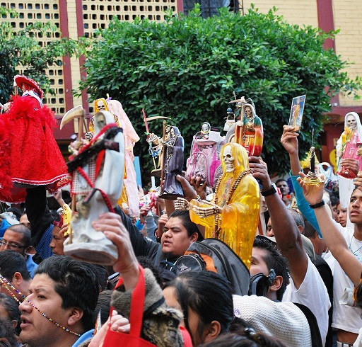

Podczas kolonizowania i nawracania obu Ameryk mało kto zastanawiał się, jaki efekt da zaszczepienie europejskiego katolicyzmu na grunt silnie religijnych społeczności lokalnych, takich jak Aztekowie. Mimo oczywistych różnic, wierzenia przybyszów i tubylców miały ze sobą zaskakująco dużo wspólnego: ofiary z ludzi, bogowie śmierci i magiczne praktyki u rdzennych Meksykanów oraz ofiara Jezusa, memento mori i różnorodne nabożeństwa u katolickich przybyszów. Wymieszanie tych dwóch religii dało zaskakujący efekt, zdobywający coraz więcej zwolenników – kult Świętej Śmierci.

Rdzenni mieszkańcy Środkowej i Południowej Ameryki od wieków byli ludźmi pobożnymi, czy wręcz zabobonnymi. Przychylność bogów próbowali zjednać sobie przez wymyślne praktyki, w tym ceremonialne wojny między plemionami czy znane wszystkim ofiary z ludzi. Jednymi z najbardziej potężnych bóstw byli Mictlantecuhtli i Mictecacihuatl - królowa i król Mitclanu, azteckiego świata zmarłych. Wyobrażani byli jako szkielety, często w strojach władców, a traktowani byli z wielkim szacunkiem i bojaźnią, gdyż śmierć była najważniejszym aspektem życia ówczesnych mieszkańców Meksyku. Na ich cześć był urządzany czterotygodniowy festiwal, podczas którego celebrowano śmierć i przodków. Kiedy Aztekowie zetknęli się z kulturą i religią przybyszów z Europy, okazało się, że śmierć jest równie ważna dla katolików – mocno lansowana w średniowieczu (szczególnie po okresie wielkich epidemii), jako główne narzędzie Boga i nieunikniona brama do tamtego świata.

Pod wpływem działalności misjonarskiej i militarnej przybyszów, wielu autochtonów zaczęło przyjmować nową wiarę. Jednak proces ten zachodził specyficznie – na świętych miejscach pogan stanęły chrześcijańskie krzyże, a obok figur Jezusa i Matki Bożej pojawiły się figury świętych, łudząco podobnych do azteckich bogów. Tak było też w przypadku Mictlantecuhtli, jej kult przetrwał jako kult dobrej śmierci w wielu wioskach położonych daleko od głównych ośrodków, a katolicka uroczystość Wszystkich Świętych zlała się z pogańskim dniem zmarłych. W XVIII w. kroniki Inkwizycji mówią o tubylcach, którzy proszą figurę przedstawiającą ubrany w kobiecie szaty szkielet, aby spełniła ich życzenia, nazywając ją Santa Muerte (hiszp.. Święta Śmierć). Kult ten trwał w Meksyku, stawiano przydrożne kapliczki i tworzono wizerunki Śmierci, ubranej czasami jak anioł lub Maryja, w towarzystwie św. Michała Archanioła lub św. Judy Tadeusza – ulubionego świętego Meksykanów. Chrześcijaństwo amatorsko wymieszane z regionalnymi kultami pojawiało się nie tylko w Meksyku, ale w całej Ameryce Środkowej i Południowej.

Na początku XXI wieku kult Santa Muerte trafił do świadomości całego społeczeństwa dzięki nagłośnieniu przez media –mroczny charakter religii łączył ją z gangsterami i przestępcami, pogląd pogłębił fakt znalezienia kapliczki Pani Śmierci w mieszkaniu Daniela Lopeza, jednego z największych ówczesnych kryminalistów. W roku 2001 w Mexico City została otwarta pierwsza oficjalna świątynia Wszechmocnej Pani – kilka lat później wyznawcami jej kultu miało być 5 milionów Meksykanów (5% społeczeństwa), a obecnie szacuje się liczbę wyznawców na 12mln na świecie (głównie Meksyk, USA i kraje Ameryki Płd.). Mimo przydomka Kostuchy, jej kult jest potępiany przez Kościół Katolicki jako pogański czy wręcz satanistyczny. Sami wyznawcy Szefuńci (jak o niej mówią) utrzymują, że są pobożnymi katolikami, a swoją Panią uważają za najważniejszą siłę po Bogu.

Święta Śmierć jest przedstawiana jako żeński szkielet w zdobionych szatach, trzyma w ręku kosę i kulę ziemską, gdyż ma ona moc nad całym światem. Często przedstawiana jest jak „szkielet Matki Boskiej”. Jej wyznawcy składają jej ofiary (świece, wodę święconą, alkohol, papierosy, kwiaty), modlą się do niej słowami katolickich modlitw (Ojcze Nasz czy Różaniec) oraz zawierają z nią pakty, prosząc o pomoc dla bliskich lub o nieszczęście dla wrogów. Podobno Biała Pani słynie ze skuteczności spełnianych obietnic, miał być to też jeden z powodów gwałtowanego wzrostu jej kultu na początku obecnego wieku. Santa Muerte nie tylko może sprowadzić śmierć, ale pomaga w chorobach, uzdrawia oraz przeprowadza wiernych na tamten świat. Niestety, będąc jej wyznawcą trzeba być czujnym – Wszechmocna Pani pamięta o wyświadczonych przysługach, domaga się za nie zapłaty, a jeśli ktoś życzy komuś źle, może być pewien, że zła energia wróci do niego.

Santissima (Najświętsza) jest uważana przez wyznawców za anioła stworzonego przez Boga i jego prawą rękę. Niektórzy wierzą, że jest ona upadłym aniołem, który opiekuje się czyśćcem i duszami zmarłych, a przez liczne cuda chce przywrócić sobie łaskę u Boga. Jej kult jest najsilniejszy w szemranych dzielnicach oraz wśród biedoty, ale tak czy inaczej liczba wyznawców z każdym rokiem wzrasta, także wśród wyższych klas i poza granicami Meksyku. Być może niedługo Święta Śmierć doczeka się swojej własnej, odrębnej od katolicyzmu religii.