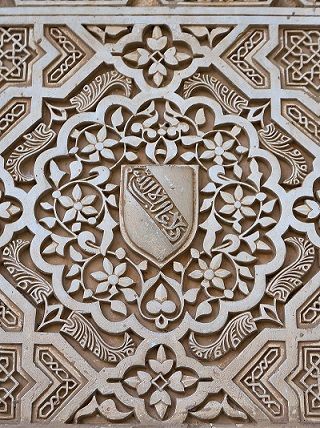
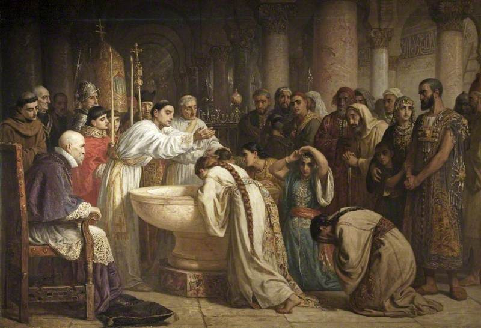
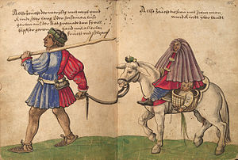
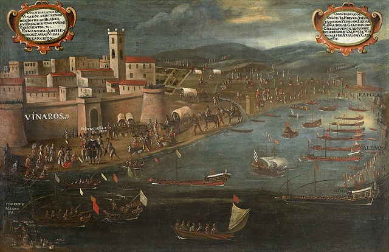

Al-Andalus zajmuje ważne miejsce w dziejach Europy. Wielu historyków uważa, że było to miejsce spotkań i wymiany kulturowej, a tłumaczenia dzieł z arabskiego na łacinę przyczyniły się do odświeżenia spuścizny antyku na Zachodzie. Islam pojawił się w Iberii w wyniku podbojów w VIII wieku. Pod kontrolą chrześcijan pozostały jedynie odludne ziemie na północy. Przez wieki muzułmanie w Iberii górowali nad chrześcijańskimi sąsiadami pod każdym względem- kulturowym, ekonomicznym i politycznym. Kolejne fale konwersji, emigracje Mozarabów (andaluzyjskich chrześcijan) oraz imigracje Arabów i Berberów sprawiły, że około X wieku islam zdominował Andaluzję. Z czasem jednak iberyjscy chrześcijanie zaczęli ekspansję na południe. Pod koniec XV wieku padło ostatnie islamskie państwo półwyspu- emirat Granady. Rekonkwista dobiegła końca. Nie był to jednak koniec islamu na półwyspie Iberyjskim.

Wielu muzułmanów wyemigrowało, ale wielu wolało zostać. Propaganda przedstawiała ich jako najeźdźców, ale w rzeczywistości Iberia była jedyną ojczyzną jaką znali. Przez wieki ludzie mieszali się, zmieniali religię i migrowali- stąd trudno ocenić skład etniczny tej grupy. Jeśli chodzi o liczebność to powszechnie przyjmuje się liczbę ok. 300k (koniec XVI wieku). Liczbę wszystkich ówczesnych mieszkańców Hiszpanii szacuje się zaś na 8 milionów. Muzułmanie byli zatem niewielką mniejszością (ok. 4%). Piszę o “muzułmanach”, ale od początku XVI wieku wystartowały przymusowe konwersje. Nietolerancja zaczęła się od Żydów- zostali oni wygnani z Hiszpanii w 1492 roku. Katoliccy monarchowie domagali się tego samego od portugalskich sąsiadów. Ci do kompletu dorzucili jeszcze muzułmanów. Wszyscy innowiercy stanęli przed wyborem- przyjąć chrzest, udać się na wygnanie albo… zostać niewolnikiem- bardzo miłosierne, w końcu mogli zabić*. Dodatkowo chrześcijańska miłość bliźniego sprawiła, że przepisy te dotyczyły tylko osób dorosłych. Dzieci miały nakaz pozostać w Portugalii i przejść przez katechezę oraz zostać ochrzczone- może traciły rodzinę i dom, ale za to zyskiwały szansę na wieczne zbawienie.

W Hiszpanii, traktatu pokojowy z 1492 roku gwarantował muzułmanom wolność wyznania. Jedną z przyczyn późniejszej zmiany były zawiedzione nadzieje. Kościół liczył na to, że muzułmanie zaczną nawracać się na chrześcijaństwo- zwłaszcza ci, których przodkowie przyjęli islam niedawno. Zadbano o to aby duchowieństwo wysłane do Granady władało językiem arabskim. Pierwsza dekada po podboju pokazała, że nadzieje te były płonne. Konwersje były bowiem rzadkie. Szczególnie bolesna była kwestia “elche” (ludzi którzy byli chrześcijanami, ale nawrócili się na islam)- większość z nich pozostała przy nowej religii. Do akcji włączył się arcybiskup Toledo, Cisneros, piastujący funkcję Wielkiego Inkwizytora. W wyniku jego konfrontacyjnych działań w Granadzie doszło do niepokojów. Cisneros wykorzystał to i zaczął głosić, że to muzułmanie złamali warunki pokoju i gwarancje przestają obowiązywać. Monarchowie zgodzili się z nim i ludzie Cisnerosa dostali pozwolenie na ostrzejsze traktowanie muzułmanów. W wyniku pierwszych kampanii chrześcijaństwo “przyjęło” około 50k osób. List gratulacyjny do Cisnerosa napisał sam papież Aleksander VI.

Działania te doprowadziły do buntu. Niepokoje przeniosły się na prowincje. W lutym katoliccy monarchowie wysłali wojsko aby opanować sytuację- doszło do walk i okrutnych masakr (na przykład spalenie żywcem 600 cywilów, którzy schronili się w meczecie). Rewoltę zdławiono do 1501 roku, a warunki jakie zaoferowano pokonanym znacznie różniły się od tych z 1492 roku. Mieli do wyboru: 1. zostać i ochrzcić się 2. zostać, nie ochrzcić się i zostać niewolnikiem 3. nie ochrzcić się i wyjechać z Hiszpanii. Władze wcale nie były zainteresowane masową migracją muzułmanów a wręcz starały się ją utrudnić- opcja 1 i 2 były bowiem korzystniejsze z ich punktu widzenia. Wydarzenia z 1501 roku w zasadzie delegalizowały wyznawanie islamu w Granadzie. Datę tę powszechnie uważa się za narodziny tak zwanych Morysków. Termin ten oznaczał ludność, która pod przymusem przyjęła chrzest a w tajemnicy nadal praktykowała islam i stare zwyczaje.

Moryskowie nie żyli tylko w Granadzie. W Hiszpanii były inne tereny na których istniały liczne wspólnoty muzułmańskie (np. Avila czy Toledo). W 1502 roku delegalizacja islamu została rozszerzona na całość ziem królestwa Kastylii (największe królestwo wchodzące w skład korony hiszpańskiej). Co ciekawe tym, którzy nie chcieli przyjąć chrztu zabroniono emigracji do Mauretanii (tereny współczesnego Maroka, Tunezji i Algierii) oraz Turcji. Jedyną dozwoloną destynacją był Egipt. Wielu ludzi po prostu nie było stać na podróż w tak odległe strony. W przeciwieństwie do Granady nie mamy prawie żadnych świadectw masowych chrztów. Historycy podejrzewają, że jest to efekt tego, że konwertyci po masowych ceremoniach chrzcielnych trzymali się najdalej jak to możliwe od kościoła. W 1515 roku delegalizację rozszerzono na ziemie królestwa Nawarry, a w 1526 roku prawo to wprowadzono również w Aragonie.

Duchowni dość szybko zorientowali się, że miażdżąca większość ich nowych “braci w wierze” nie ma i nie chce mieć nic wspólnego z chrześcijaństwem. Teksty z epoki pokazują, że konwersje były fikcją. Wbrew katolickim nadziejom ten stan rzeczy dotyczył nie tylko wykształconych i świadomych ludzi, ale także niższych warstw. Moryskowie unikali uczestniczenia w katolickich obrzędach. Szybko wprowadzono kary za brak obecności na niedzielnym nabożeństwie, ale i to na niewiele się zdało. Do spowiedzi przystępowali bardzo rzadko i niedbale recytowali wyuczone formułki. W każdy piątek spotykali się w gronie rodziny i za zamkniętymi drzwiami odmawiali salat. Chrześcijańscy pisarze donoszą ponadto o zwyczaju obmywania przez Morysków dzieci w ciepłej wodzie zaraz po chrzcie (miało to służyć zmyciu wody chrzcielnej i oleju). W przypadku chłopców rodzina dokonywała rytualnego obrzezania. Moryskowie często mieli podwójne imiona- chrześcijańskie którym posługiwali się w kontaktach z sąsiadami oraz muzułmańskie, którego używali w ramach swojej grupy.

Śluby odbywały się wprawdzie w kościele, ale zaraz potem świętowano w domu, “po islamsku”, a panna młoda zrzucała z siebie suknię i przyodziewała się w muzułmański strój. Dzieci były uczone języka arabskiego, kuchni andaluzyjskiej, muzułmańskich modlitw, legend, wierszy a nawet gry na charakterystycznych dla kultury arabskiej instrumentach. Moryskowie zachowali muzułmańską tożsamość i świadomość do tego stopnia, że kronikarze oskarżają ich o wspieranie afrykańskich piratów, którzy ze swoich baz w Algierii atakowali hiszpańskie wybrzeża. Niektóre z tych oskarżeń mogą być przesadzone, ale niezaprzeczalnie istniały kontakty między wspólnotami Morysków a krajami muzułmańskimi. Moryskowie byli rozdarci między dwoma światami, co często znajdowało odbicie w ich życiu- wielu krążyło między Afryką a Iberią trudniąc się piractwem, kupiectwem czy żołnierką. Muzułmanie z innych regionów odnosili się do nich z szacunkiem, widząc w nich uciemiężonych braci w wierze.

W reakcji na radykalną zmianę warunków życia muzułmanów, liderzy religijni wydali specjalny dekret w 1504 roku. Łagodził on zasady życia codziennego tak aby Moryskowie mogli jakoś funkcjonować i pozostawać muzułmanami. I tak na przykład potępiał kult przedmiotów i przedstawień ludzi, ale zezwalał nań jeśli był konieczny do przetrwania. Napominał wiernego aby w myślach modlił się do Boga. Przypominała o obowiązku modlitwy zezwalając jednak aby nie odbywała się ona o ustalonych porach, publicznie i w kierunku Mekki. To samo dotyczyło rytualnych ablucji (obmywanie się)- jeśli nie dało się ich zrobić zgodnie ze zwyczajem to za legitne uznawano nawet kąpiel w morzu czy zwykłe wytarcie rąk. Zezwalał nawet na picie alkoholu, jedzenie wieprzowiny i deklarowanie, że Jezus jest Synem Bożym jeśli miało to ocalić wiernego przed prześladowaniem. Nakazywał jednak aby kultywować swoje zwyczaje i wierzenia w gronie rodziny i dbać o ich przekazywanie kolejnym pokoleniom.

Dzięki tymczasowemu złagodzeniu wymagań, oświatowej działalności muzułmańskich liderów religijnych i silnego sprzeciwu wśród miażdżącej większości morysków- iberyjski islam przetrwał przymusowe konwersje. W kościelnych pismach z pierwszej połowy XVI wieku widać narastającą bezsilność wobec fiaska ewangelizacji “Nowych Chrześcijan” (tak nazywano nawróconych muzułmanów). Luis del Marmol, hiszpański kronikarz żyjący w Granadzie tak podsumował sytuację:

”Mówią o sobie, że są chrześcijanami, ale nietrudno dostrzec, że więcej uwagi przywiązują do rytu mahometańskiego niż do katolickiego. Z wielką gorliwością zamykają uszy na nauczanie naszych biskupów, księży i mnichów… Wierząc w swoje puste wymysły które zowią j’ofores, czyli przepowiednie, pokładają w nich całą nadzieję, ufając, że będą mogli jeszcze wrócić do bycia Maurami (muzułmanami).” 

Władze kościelne stosunkowo szybko doszły do wniosku, że skoro nie działa “po dobroci” (o ile wybór niewolnictwo lub chrzest to dobroć) to trzeba “na chama”. Był to tym bardziej palący problem, że niektórzy chrześcijańscy osadnicy zaczynali interesować się odmiennością Morysków i zdarzały się na przykład sytuacje gdy “Stare Chrześcijanki” ubierały się po “mauretańsku”. Zaczęto zwalczać muzułmańskie zwyczaje- na przykład zakazano nosić ciuchy kojarzone z islamem. Walczono także z łaźniami, bo z przyczyn religijnych muzułmańskie mieszczaństwo przywiązywało dużą wagę do higieny, a łaźnie były miejscem spotkań które cementowały społeczność. Nakładano specjalne podatki na “juglares” (minstreli)- w muzułmańskim społeczeństwie wędrowni poeci i bajarze cieszyli się dużym szacunkiem, a w warunkach opresji ich działalność służyła zachowaniu “starej” kultury. Zwalczano znajomość arabskiego wśród Morysków tak aby nie mieli dostępu do prac swoich przodków. W późniejszych czasach posiadając książkę po arabsku narażało się na karę śmierci wszystkich domowników.

Sytuacja Morysków była nieco paradoksalna- z jednej strony starano się wykorzenić z nich islam i andaluzyjską kulturę, a z drugiej wielu członków społeczeństwa na każdym kroku podkreślało ich odrębność. Było to pokłosie niezwykle popularnego w Hiszpanii i Portugalii przekonania o “czystości krwi” oraz budowaniu wspólnej tożsamości chrześcijańskich mieszkańców półwyspu w opozycji do muzułmańskich “najeźdźców”. Teorie o czystości mówiły o tym, że iberyjski etnos został skażony domieszkami berberyjskiej, arabskiej i żydowskiej krwi. Im krew czystsza tym dany osobnik szlachetniejszy i bardziej wartościowy. Wokół tej idei powstało wiele praw i poglądów mających realny wpływ na hiszpański system polityczny i prawny (także w koloniach). Bardzo wybili się na nim Baskowie, jako ludność pochodząca z terenów, które nigdy na dłuższą metę nie znalazły się pod obcym panowaniem (a więc mająca potencjalnie najczystszą krew). Tworzono całe klasyfikacje “rasowe” ludzi i na ich podstawie próbowano przyznawać prawa i ustalać pozycję danej jednostki.

To oraz przywiązanie Morysków do swojej religii i korzeni sprawiły, że zachowali swoją odrębność. Był to prawdziwy cierń dla władz hiszpańskich, które wobec groźby muzułmańskiej inwazji (w drugiej połowie XVI wieku piraci z Afryki regularnie najeżdżali wybrzeża, a Turcja wyrastała na pierwszą potęgę basenu Morza Śródziemnego) postrzegały Morysków jako V kolumnę. Chcąc wykorzenić poczucie przynależności do świata muzułmańskiego wokół Morysków zbudowano coś na kształt państwa policyjnego z inkwizycją na czele. Od upadku powstania Morysków w 1570 roku trybunały inkwizycyjne wzięły te społeczności pod lupę. Aż 82% wszystkich spraw inkwizycji w Granadzie dotyczyło Morysków. Śledztwa toczyły się masowo także w Saragossie i Walencji. Rozbijano lokalne społeczności i rodziny, aresztując i torturując podejrzanych o bycie liderami i uczonymi (w nich upatrywano źródła “problemu”). Nawet cień podejrzenia o praktykowanie islamu czy zwyczajów z islamem powiązanych prowadził do dochodzenia inkwizycyjnego. Jeśli podejrzanemu udowodniono “winę” to często kończyło się na karze śmierci.

Ostateczne rozwiązanie kwestii Morysków przyszło w 1609 roku. Król Filip III wydał dekret nakazujący ich wygnanie. Setki tysięcy ludzi musiały opuścić swoje domostwa jeśli chciało przeżyć. W razie odmowy dekret królewski zezwalał na zabicie “rebeliantów” bez sądu. Wyrzucanym nie pozwolono na zabranie ze sobą dobytku i większej ilości pieniędzy. Nie wiedząc kto jest zasymilowany a kto trwa przy islamie i kulturze andaluzyjskiej, zdecydowano się na wyrzucenie wszystkich potomków konwertytów (wśród nich zapewne byli faktyczni katolicy). Niektóre regiony (zwłaszcza okolice Walencji i Granady) mocno się wyludniły i podupadły ekonomicznie. Na opornych lub powracających w późniejszych latach napuszczono inkwizycję. W Iberii pozostały naprawdę nieliczne wspólnoty Morysków i według historyków uległy one totalnej asymilacji do końca XVIII wieku. Wielu wygnanych osiedliło się w Afryce i zasiliło szeregi piratów atakujących hiszpańskie wybrzeża. W późniejszych czasach zasymilowali się z ludnością Maroka, Algierii i Tunezji.
