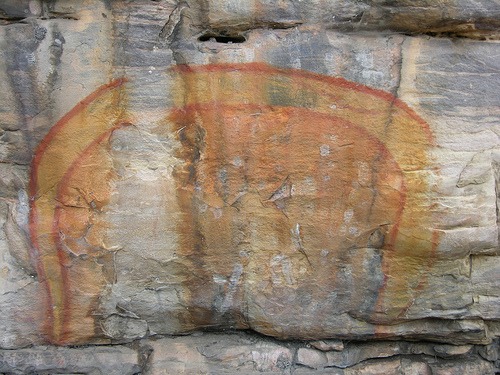
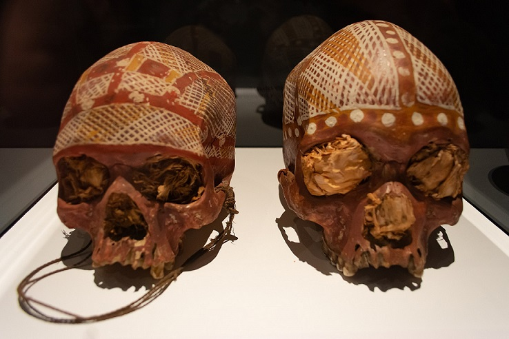

Ślady osadnictwa rdzennych mieszkańców Australii sięgają 40 tysięcy lat wstecz (na ten okres datowane są najstarsze znaleziska). Od tamtego czasu ich kultura rozwijała się aż do przybycia pierwszych osadników w XVIII wieku. Plemiona Aborygenów stworzyły około 260 języków, z czego do dzisiaj zachowało się 50 (90% z nich jest zagrożone wymarciem). Utworzyli także bardzo złożoną mitologię, która definiowała całe życie tych ludzi.

Podstawowym pojęciem w mitologii Aborygenów jest tzw. Czas Snu. Nie należy go mylić z letargiem, czy nieświadomością – był to okres, w którym ziemia istniała na styku świata fizycznego i metafizycznego, nie istniało pojęcie przeszłości, teraźniejszości czy przyszłości. Ze Snu wynurzyli się mityczni przodkowie – fantastyczne istoty (utożsamiane przez niektórych z kosmitami), które przyjmowały różne formy: człowieka-kangura, mężczyzny-figi, kobiety-ryby, czy ludzi-emu. Ich życie nie różniło się od życia późniejszych ludzi - jedli, kochali się, walczyli, umierali, polowali, ale każda ich czynność miała moc stwórczą. W ten sposób powstały rzeki, góry, równiny, rośliny, zwierzęta i ostatecznie ludzie. Miejsca, które przodkowie osobiście minęli, stały się miejscami świętymi. Przodkowie nauczyli ludzi wszystkiego co umieli, a także dali instrukcje jak obchodzić się ze świętymi miejscami – ważna jest umiejętność obchodzenia się z takim miejscem, gdyż nieodpowiednie zachowanie może spowodować koniec świata. Aborygeni wierzą, że wiedzę przekazaną przed przodków należy przekazywać i podtrzymywać, gdyż jest to gwarantem istnienia świata i jego harmonii. W ten sposób powstał szereg mitów, opowiadanych w formie ustnej lub za pomocą tańca.

Najważniejszy mit, to mit o stworzeniu świata w Czasie Snu, który posiada różne wersje w zależności od regionu. Istnieje najwyższe bóstwo, znane pod różnymi imionami (Baiame, Altrija) i utożsamiane z Tęczowym Wężem – najpotężniejszym z mitycznych przodków. Stworzył on słońce, niebo, księżyc i gwiazdy, ziemia natomiast istniała od początku, ale była zupełnie płaska. Niebo było tak nisko, że ptaki nie mogły latać, a wszystkie żywe stworzenia i przodkowie byli wielkości mrówek (łącznie z Tęczowym Wężem). Nie istniały rzeki ani jeziora, tylko jedno magiczne źródło, które było tak dobrze ukryte, że nawet Tęczowy Wąż nie wiedział gdzie ono jest. Po długich poszukiwaniach (w wyniku których powstały długie i kręte łańcuchy górskie) Wąż znalazł źródło i wypił jego chłodną wodę, dzięki czemu posiadł czarodziejską moc. Pozwoliła mu ona na podniesienie nieba, rozpinając je w łuk nad ziemią, tak aby ptaki mogły latać, drzewa rosnąć, chmury się uformować i wypuścić deszcz. Wtedy ziemia się zazieleniła, a Tęczowy Wąż stworzył ludzi. Każdy człowiek powstaje z wniknięcia ducha-zarodka (duszy) w fizyczne ciało, dodatkowo posiada totem, który jest z nim związany jako patron, doradca i pomocnik przez całe życie.

Kluczowym elementem kultury Aborygenów jest przekazywanie wiedzy o świecie nowym pokoleniom, tak jak czynili to mityczni przodkowie. Można to czynić za pomocą malunków, tańca, opowieści czy pieśni. Wszystkie te historie tworzą swego rodzaju kodeks, czy zbiór reguł rządzących życiem. Kto z kim może zawrzeć małżeństwo to tak samo uregulowana kwestia, jak to, dlaczego nie powinno się wygrzebywać zbyt wielu smacznych korzeni w jednym miejscu. Dodatkowo fakt, że jakieś miejsce, kamień czy drzewo jest święte, zależy od tego, czy wiedza o tym jest żywa i przekazywana. Dlatego tak wielkim nieszczęściem dla australijskich autochtonów był przymus porzucenia języka, obyczajów i religii, narzucony przez kolonizatorów. Aborygeni byli obiektem wielu masakr ze strony osadników, a ci którzy chcieli się schronić w miastach lub w misjach, musieli przyjmować europejskie zwyczaje. Dopiero w 1967r. Aborygeni wywalczyli pełnię praw obywatelskich. Tym niemniej zostało ich mniej niż 220tys., co sprawia, że ich kultura i religia może być niedługo zagrożona wymarciem.